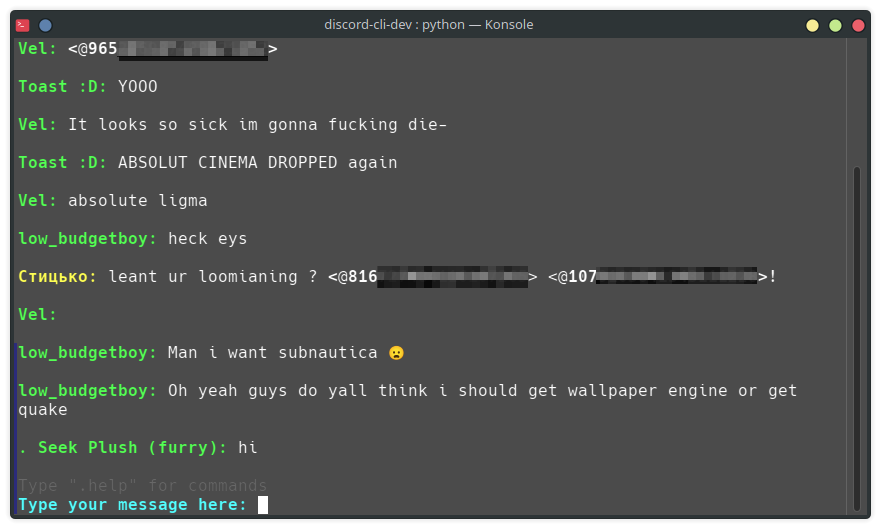

# Discord-CLI
Discord CLI is a Discord command-line client made purely in Python.

It has the most necessary features for a usable Discord client, like:
- Sending, replying, editing and deleting messages
- Switching betweeen channels and servers
- changing your status indicator
- ...and more!

But unfortunately, there are a lot of cons currently, such as:
- Selected channel doesn't automatically update messages
- Not being able to see sent images (or at least the link to that image)
- Difficult to switch betweeen channels and servers

But I'm hoping to resolve those issues soon (maybe) :D
## Installation
**To start using Discord CLI, you'll need to follow the instructions first.**

### Requirements:
  1. Python should be installed on your device
  2. Your Discord token
  3. Your Discord username

First, download the source code of Discord CLI by going into the "Releases" tab, download the latest version and extract it.

Now, if you don't know already how to get your Discord token, go to this link [here](https://gist.github.com/MarvNC/e601f3603df22f36ebd3102c501116c6).
Once you have your Discord token, paste it into the file `token.txt` (don't forget to remove the placeholder in the file).
And put your Discord username into the file `username.txt` (again, remove the placeholder in the file first).

The last step is to install the required Python libraries by typing this command: `pip install -r requirements.txt`

Now you should be good to go! Just open `discord-cli.py` and you should be able to use it without any problems.

If you have any questions, bug reports, or really anything, make sure to DM me on Discord [here](https://discord.com/users/728655009759363191).

Anyways, have fun using Discord CLI!

> [!WARNING]
> Automated user accounts or "self-bots" are against Discord's TOS. <ins>**I am not responsible for any loss and/or damages caused by Discord CLI.**</ins>
